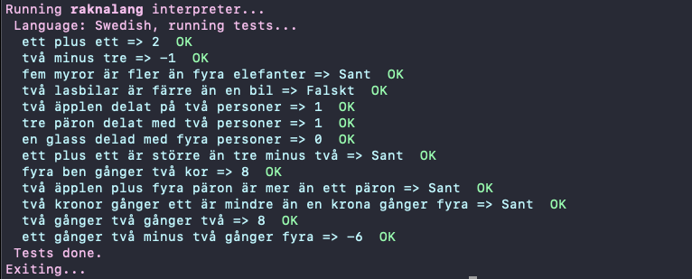
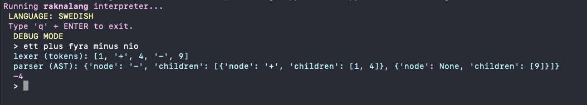
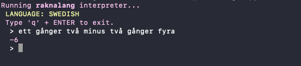

# raknalang (räknalang)

This is a simple domain-specific programming language to do basic arithmetic calculations in natural language.

## Getting started

1. First, `$ python main.py` to start interpreter
	- `--test` to run tests

		

	- `--debug` to show output from lexer and parser

		

2. then, enter some calculation in natural language
	- e.g. enter `ett gånger två minus två gånger fyra` + ENTER gives result `-6` (`1 * 2 - 2 * 4`)

		

3. finally, enter 'q' + ENTER to exit.

## TODO

- use any number as input, see [https://michaelsjoeberg.com/programming/python/project-euler-problems/number-letter-counts](https://michaelsjoeberg.com/programming/python/project-euler-problems/number-letter-counts)

## Operators

| symbol | operator     | swedish       	|
| :----: | --------     | --------      	|
| --     | COMMENT      | kommentar     	|
| +      | PLUS         | plus          	|
| -      | MINUS        | minus          	|
| >      | GREATER THAN | fler, mer, större |
| <      | LESS THAN 	| färre, mindre 	|
| /      | DIVIDE       | delat, delad      |
| *      | MULTIPLY     | gånger 	        |

## Examples

**English**

```
> one plus one
2

> two minus tree
-1

> five ants are more than four elephants
True

> two apples split on two people
1

> tree pears divided with two people
1

> one times two minus two times four
-6
```

**Swedish**
	
```
> ett plus ett
2

> två minus tre
-1

> fem myror är fler än fyra elefanter
Sant

> två lasbilar är färre än en bil
Falskt

> tre päron delat med två personer
1

> ett plus ett är större än tre minus två
Sant
```
